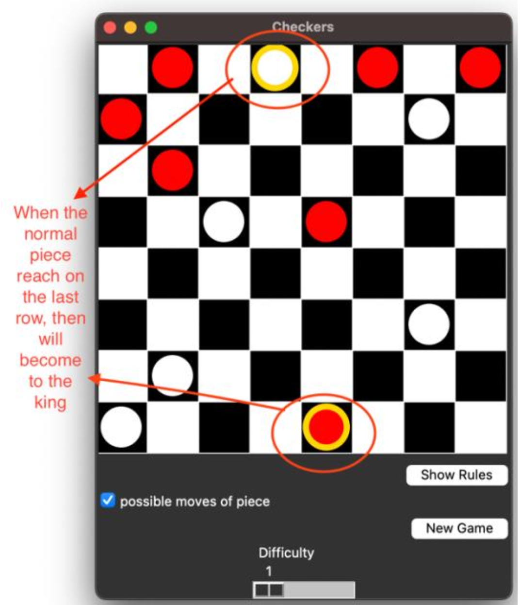
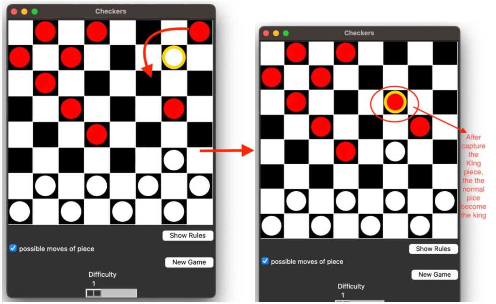
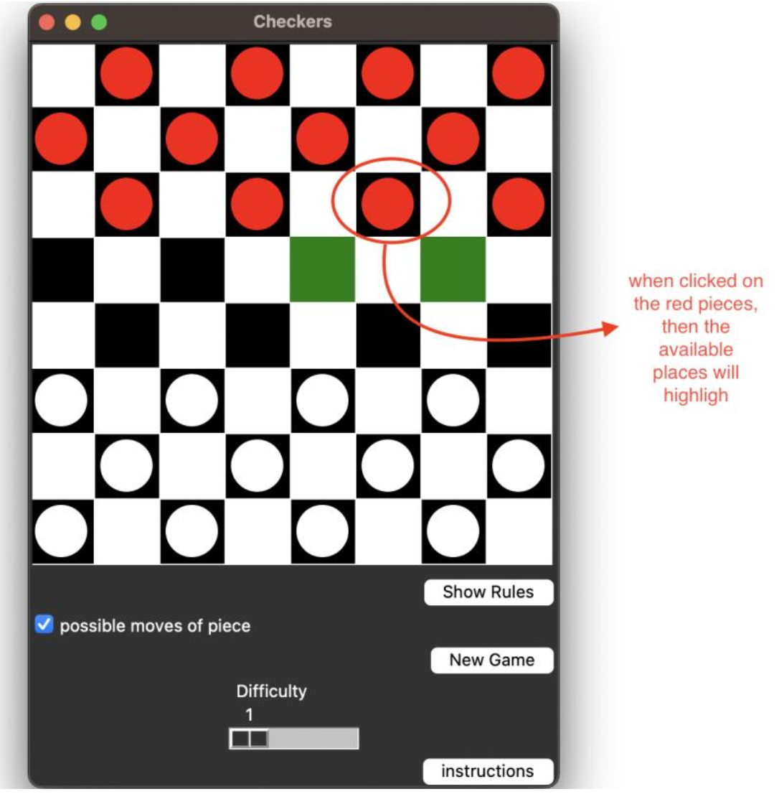

# checkers Game

 
This is a Python-based Checkers game with a GUI built by using Tkinter. In this game a user player plays against an AI opponent with adjustable difficulty levels.

## Project Structure:

`checkers.py` (The main Python script or code of the game)

`README.md` (The descriptive file about this game which is this file)

img folder (Contains the images for describting the game on this file)

## Features of the Game: 

1. **Human User plays against AI player**: 

The GUI of the game provides an interactive gameplay environment which user
can play against the AI. Additionally, the pieces of the human users are
represented as red colour and the pieces of the AI are shown as White colour.
Therefore, the user can interact with the board by clicking on red pieces and
moving to the available places, and then the AI responds with its moves.

2. **AI Difficulty Levels which is adjustable by the user**: 

As showing in the below image, there is a slider to adjust the difficulty of the game. By changing the
slider, then the depth of the minimax algorithm will change.
The following figure shows the slider which is for adjusting the level of difficulty:

3. **King Mechanics**:

Pieces are promoted to kings upon reaching the opponent's end. The following figure represents how the piece will become the king:

4. **Capture Rules**:

Normal pieces can capture kings. Then, that normal pieces will become a King pieces. The image below shows this feature: 

## How To Play the Game

1. **Move Pieces**: Click on your red pieces to highlight possible moves and select the destination. As showing ont he following figure, when you click on the the red pieces then the available places will highlight.

2. **Win the Game**: Capture all the opponent's pieces or block their possible moves.

3. **Adjust Difficulty**: Use the slider to set AI difficulty before starting.

## Requirements
- Python 3.x
- Tkinter (built into most Python distributions)

   
