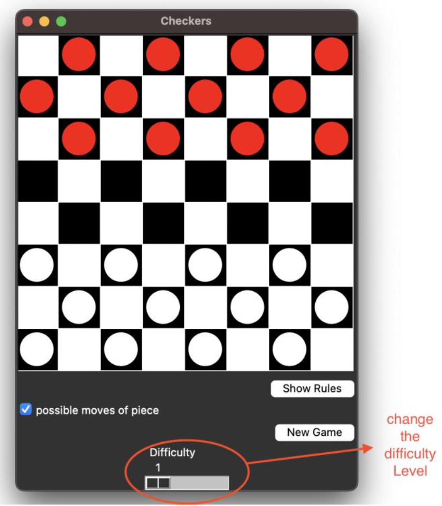

# checkers Game

 
This is a Python-based Checkers game with a GUI built by using Tkinter. In this game a user player plays against an AI opponent with adjustable difficulty levels.

## Features of the Game: 
**Human User plays against AI player**: 

The GUI of the game provides an interactive gameplay environment which user
can play against the AI. Additionally, the pieces of the human users are
represented as red colour and the pieces of the AI are shown as White colour.
Therefore, the user can interact with the board by clicking on red pieces and
moving to the available places, and then the AI responds with its moves.

**AI Difficulty Levels which is adjustable by the user**: 

As showing in the below image, there is a slider to adjust the difficulty of the game. By changing the
slider, then the depth of the minimax algorithm will change.
The following figure shows the slider which is for adjusting the level of difficulty:

